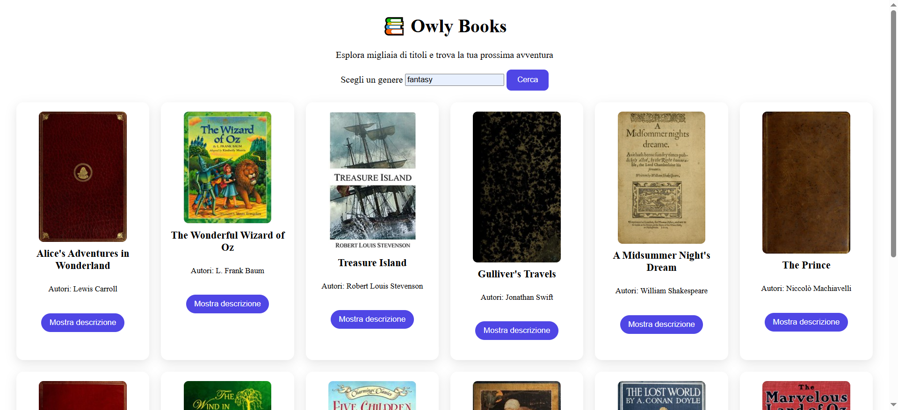

# 📚 Book Explorer – Open Library

**Demo live:** [Clicca qui per vedere l’app funzionare]https://lucianopacini.github.io/progetto-javascript-advanced-di-Luciano-Pacini/
**Repo codice sorgente:** [Clicca qui per vedere il repository]https://github.com/lucianopacini/progetto-javascript-advanced-di-Luciano-Pacini

Un’applicazione web che permette di esplorare libri per categoria utilizzando le API di Open Library, con un’interfaccia pulita, fluida e orientata all’esperienza utente.

Il progetto è stato realizzato con HTML, CSS e JavaScript vanilla, con particolare attenzione a UI/UX, gestione dello stato e organizzazione del codice.

## 🚀 Funzionalità

🔎 Ricerca libri per categoria

📖 Visualizzazione risultati con:

copertina

titolo

autore/i

🪟 Modal per visualizzare la descrizione del libro

⏳ Stato di loading

⚠️ Gestione dei casi senza risultati

🎨 Card uniformi con layout a griglia

✨ Interazioni fluide e animazioni leggere

## 🧠 Concetti chiave utilizzati

Manipolazione del DOM

Event handling

Chiamate Asincrone con Axios: Gestione ottimizzata delle risposte e dei dati.

Module Bundling: Compilazione e ottimizzazione del codice tramite Webpack.

Gestione asincrona (then / catch)

Separazione dei ruoli tra CSS (presentazione) e JavaScript (logica)

Creazione e gestione di componenti UI (card, modal)

Attenzione a UI (aspetto) e UX (esperienza)

## 🛠️ Tecnologie utilizzate

HTML5 & CSS3 (Flexbox, Grid, Transitions)

JavaScript ES6+

Axios: Per una gestione avanzata e robusta delle chiamate HTTP.

Webpack: Utilizzato come modulo bundler per ottimizzare le risorse e gestire le dipendenze.

NPM: Per la gestione dei pacchetti e degli script di build.

Open Library API: Integrazione dati esterna.

## 📁 Struttura del progetto
📦 book-explorer
 ┣ 📂 src           # Codice sorgente (Sviluppo)
 ┃ ┣ 📄 main.js     # Logica JavaScript con import Axios
 ┃ ┗ 📄 style.css   # Stili CSS
 ┣ 📂 dist          # Codice ottimizzato (Produzione)
 ┃ ┗ 📄 bundle.js   # File generato da Webpack
 ┣ 📄 index.html    # Entry point dell'applicazione
 ┣ 📄 webpack.config.js # Configurazione del Bundler
 ┣ 📄 package.json  # Gestione dipendenze e script
 ┗ 📄 README.md

## ⚙️ Sviluppo Locale

Per avviare il progetto in locale e testare il workflow di Webpack:

Clona il repository.

Esegui npm install per installare le dipendenze (Axios, Webpack).

Per compilare le modifiche, usa il comando: npm run build.

## ▶️ Come usare il progetto

Clona o scarica il repository

Apri index.html nel browser

Inserisci una categoria (es: fantasy, history, science)

Clicca su Cerca

Esplora i risultati e apri le descrizioni nel modal

## 🎯 Obiettivo del progetto

Questo progetto nasce con l’obiettivo di:

consolidare le basi di JavaScript

imparare a gestire dati da API reali

migliorare l’organizzazione del codice

curare l’esperienza utente e l’estetica dell’interfaccia

## 🔮 Possibili miglioramenti futuri

Ricerca per titolo o autore

Paginazione dei risultati

Salvataggio libri preferiti

Responsive avanzato

Migliore gestione degli errori API

## 🙌 Autore

Progetto realizzato da Luciano
Full Stack Developer in formazione